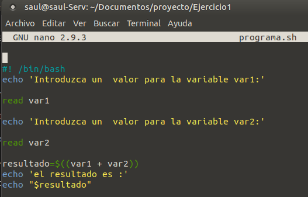
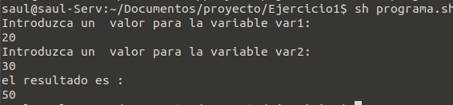

# Ejercicio1

- Primero creamos la carpeta
```
mkdir "nombre_carpeta"
```
- Accedemos a la carpeta
 ```
cd "nombre_carpeta"/
 ```
- Para iniciar el Git, dentro de la carpeta:
```
git init
```
- Para crear un script de bash
```
touch script.sh
```
- Para editarlo
```
nano script.sh
```
- Dentro escribiremos el programa




- comentamos el archivo.
```
#! /bin/bash
```
- Pedimos el primer valor al usuario
```
echo 'Introduzca un  valor para la variable var1:'
```
- almacenamos el resultado
```
read var1
```
- lo mismo con otro numero
```
echo 'Introduzca un  valor para la variable var2:'

read var2
```
- La formula de la suma
```
resultado=$((var1 + var2))
```
- imprime texto
```
echo 'el resultado es :'
```
- Se concatena con el resultado
```
echo "$resultado"
```
-Ejecutamos para ver si funciona
```
sh "nombre_programa".sh
```



